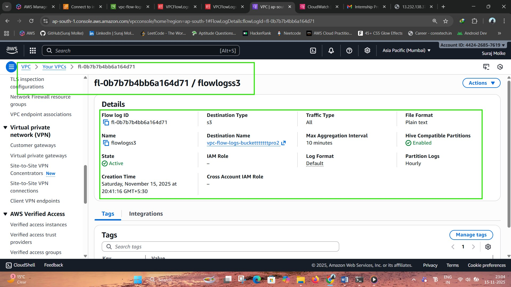
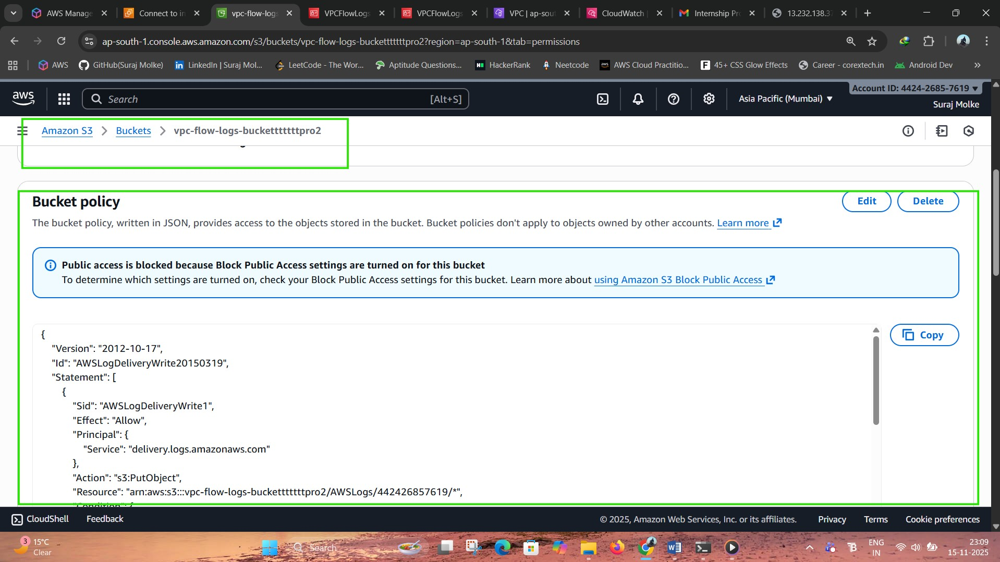
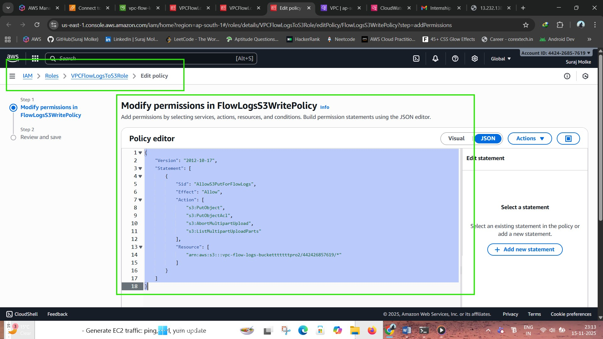
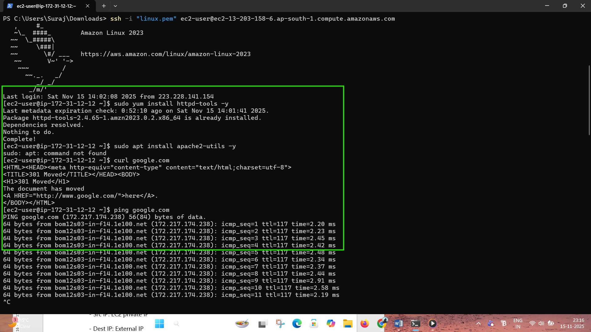
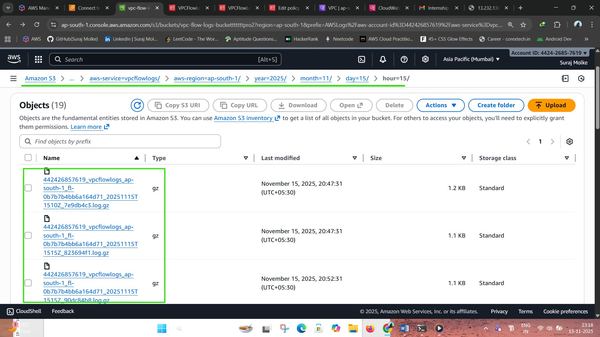

# Configure VPC Flow Logs and Store Logs in S3 Using IAM Role

This project shows how to enable **VPC Flow Logs**, create an **IAM Role** for log delivery, and store all logs securely inside an **S3 bucket**.
These logs help with **network monitoring**, **security analysis**, and **auditing** within AWS.

---

## 🚀 **Project Overview**

VPC Flow Logs capture detailed information about IP traffic flowing to and from network interfaces within a VPC.

In this project, you will:

* Enable **VPC Flow Logs**
* Store logs in an **S3 bucket**
* Create a dedicated IAM role for log delivery
* Validate logs by generating traffic on EC2
* Understand the VPC Flow Log structure

---

## 🏗 **Architecture Diagram**

```
EC2 Instances  
     ↓  
VPC Flow Logs  
     ↓  
IAM Role (Allows S3 PutObject)  
     ↓  
S3 Bucket (vpc-flow-logs-bucket)
```

---

## 📁 **Project Structure**

1. **VPC Flow Logs Setup**
2. **S3 Bucket Configuration**
3. **IAM Role for Flow Log Delivery**
4. **Traffic Generation for Testing**
5. **Flow Log Format Explanation**

---

# 🛠 **1. Configure VPC Flow Logs**

### Steps:

1. Open **AWS Console → VPC**
2. Go to **Your VPCs**
3. Select your VPC
4. Click **Actions → Create Flow Log**
5. Fill in the following:

   * **Filter:** ALL
   * **Destination:** S3
   * **S3 Bucket ARN:**  
     `arn:aws:s3:::vpc-flow-logs-bucket`
   * **IAM Role:** `VPCFlowLogsToS3Role`
   * **Aggregation Interval:** 10 minutes

Logs will be stored at:

```
s3://vpc-flow-logs-bucket/AWSLogs/<account-id>/vpcflowlogs/<region>/<vpc-id>/
```


---

# 🗂 **2. S3 Bucket Configuration**

Create a bucket named:  
**`vpc-flow-logs-bucket`**

Add the following **bucket policy**:

```json
{
  "Version": "2012-10-17",
  "Statement": [
    {
      "Effect": "Allow",
      "Principal": { "Service": "vpc-flow-logs.amazonaws.com" },
      "Action": "s3:PutObject",
      "Resource": "arn:aws:s3:::vpc-flow-logs-bucket/*"
    }
  ]
}
```


---

# 🔐 **3. IAM Role for Flow Log Delivery**

### **Trust Policy**

```json
{
  "Version": "2012-10-17",
  "Statement": [
    {
      "Effect": "Allow",
      "Principal": { "Service": "vpc-flow-logs.amazonaws.com" },
      "Action": "sts:AssumeRole"
    }
  ]
}
```

### **Permissions Policy**

```json
{
  "Version": "2012-10-17",
  "Statement": [
    {
      "Effect": "Allow",
      "Action": [
        "s3:PutObject",
        "s3:PutObjectAcl",
        "s3:GetBucketAcl",
        "s3:GetBucketLocation"
      ],
      "Resource": [
        "arn:aws:s3:::vpc-flow-logs-bucket",
        "arn:aws:s3:::vpc-flow-logs-bucket/*"
      ]
    }
  ]
}
```

Role Name: **VPCFlowLogsToS3Role**


---

# 🔎 **4. Verification & Testing**

### Run commands from your EC2 instance:

```bash
curl google.com
ping 8.8.8.8
sudo yum update -y
```



### Check S3 bucket:

```
AWSLogs/
 └── <account-id>/
      └── vpcflowlogs/
          └── <region>/
              └── <vpc-id>/
                  └── *.txt.gz
```

Logs should appear within 5–10 minutes.

---

# 🧾 **5. Understanding Flow Log Format**

Example log record:

```
2 123456789012 eni-0abc12d34ef56 10.0.1.15 142.250.182.206 443 50512 6 10 840 1668522000 1668522060 ACCEPT OK
```

| Field             | Description       |
| ----------------- | ----------------- |
| 2                 | Version           |
| 123456789012      | AWS Account ID    |
| eni-0abc12d34ef56 | Network Interface |
| 10.0.1.15         | Source IP         |
| 142.250.182.206   | Destination IP    |
| 443               | Destination Port  |
| 50512             | Source Port       |
| 6                 | Protocol (TCP)    |
| 10                | Packets           |
| 840               | Bytes             |
| Time              | Start & End       |
| ACCEPT            | Action            |
| OK                | Log Status        |

---



